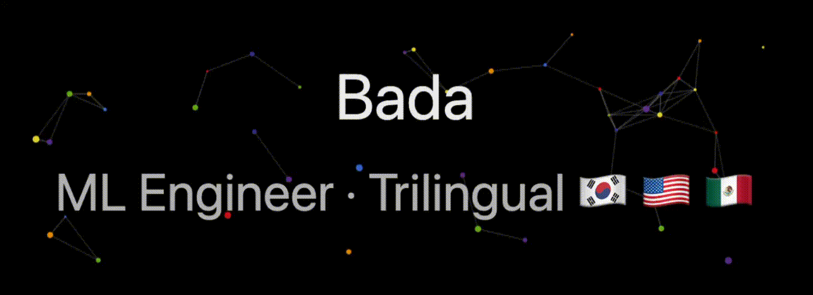

  

## 👋 About Me

- 저는 머신러닝과 딥러닝을 좋아하며, 세상의 다양한 문제들을 해결하는 것을 즐깁니다.
- Fluent in three languages: Korean 🇰🇷, English 🇺🇸, and Spanish 🇲🇽
- "Alguien me dijo que cuando hablas español, te ves más feliz." 😊

## 🛠️ Tech Stacks

## 🚀 Projects

| Project | Description |
|---------|-------------|
| [**project-puente**](https://github.com/vamosbada/project-puente) | Research paper on Spanish-English code-switching sentiment analysis · KSC 2025 Award 🏆 |
| [**Zerothon**](https://github.com/vamosbada/TIL/tree/main/Projects/Zerothon-2025) | Campus hackathon · 2nd Place / Excellence Award (Team Lead) 🥈 |

## 📫 Contact

