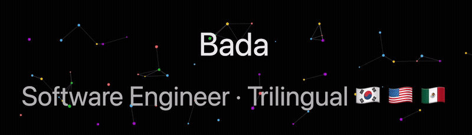

  

## 👋 About Me

**안녕하세요 🇰🇷, Hello 🇺🇸, Hola 🇲🇽 — 셋 다 저예요.**
*Thinking in Korean, coding in English, living in Spanish.*

- AI 시스템을 프로덕션에서 안정적으로, 빠르게, 싸게 굴리는 데 관심이 있습니다
- Looking for a bigger arena and better people — I want to see where my ceiling really is.
- "Alguien me dijo que cuando hablas español, te ves más feliz." 😊

## 🛠️ Tech Stacks

## 🚀 Projects

| Project | When | Description |
|---------|------|-------------|
| [**grimsup**](https://github.com/vamosbada/grimsup) | 2026.03– | Art academy platform I built and run alone — design, operations, and incident write-ups, the code itself stays private · [grimsup.com](https://grimsup.com) 🎨 |
| [**project&#8209;puente**](https://github.com/vamosbada/project-puente) | 2025.05–12 | Spanish-English code-switching sentiment analysis — fixing 17% of a benchmark's labels beat every model change we tried, +10.55 pp final · KSC 2025 Honorable Mention 🏆 |
| [**patron**](https://github.com/vamosbada/patron) | 2025.07–12 | Chart pattern similarity search — ResNet18 + Triplet Loss + FAISS over ~50k patterns, served via FastAPI 📈 |
| [**Zerothon**](https://github.com/vamosbada/TIL/tree/main/Projects/Zerothon-2025) | 2025.03 | AI-assisted team dashboard for a campus hackathon — led a team of five, built in four days · 2nd Place / Excellence Award 🥈 |

## 📫 Contact

